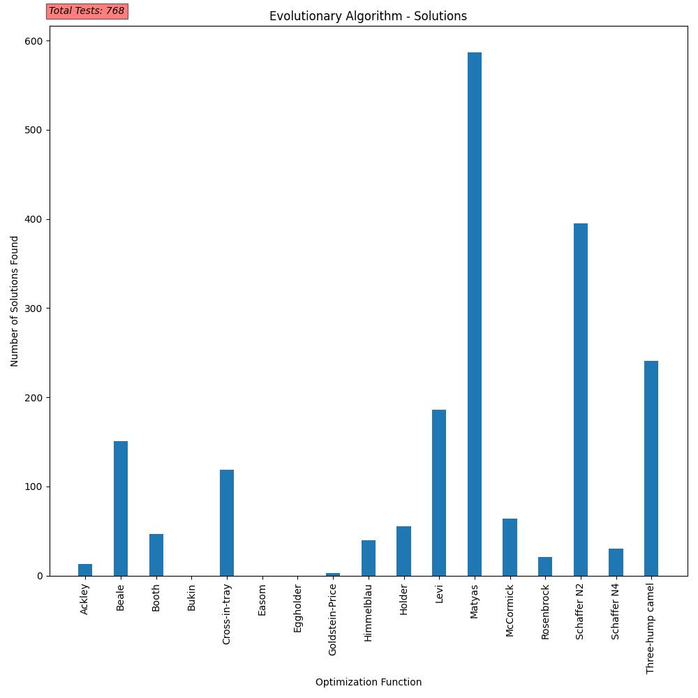
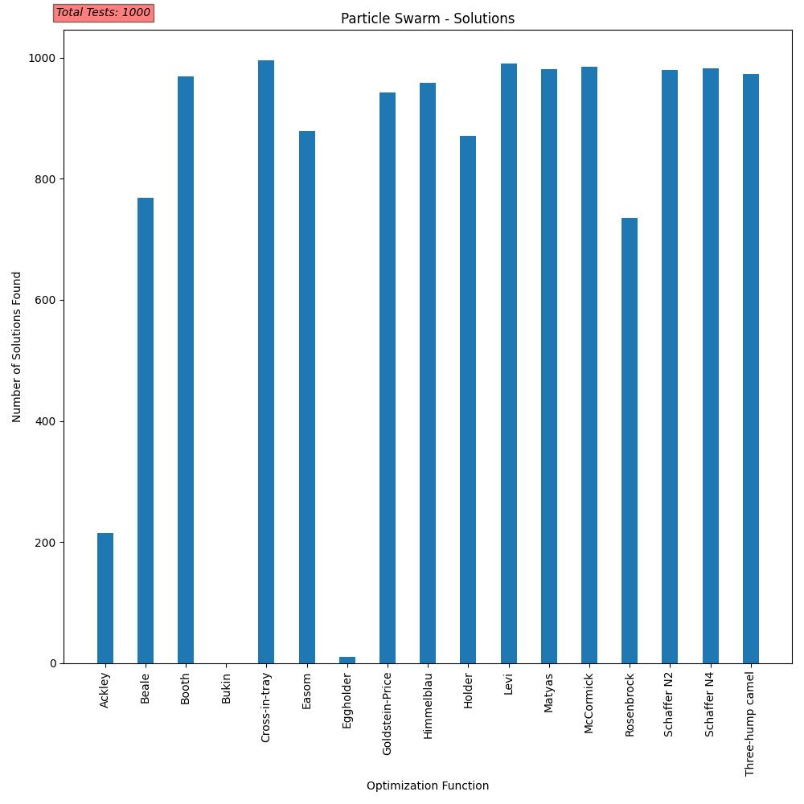

# TestFunctionOptimization

There are many test functions for optimization that are used in biologically inspired computation. This project tested 17 different functions using particle swarm optimization and an evolutionary algorithm. The final project report can be found [here](https://github.com/hkitts/TestFunctionOptimization/blob/main/hkitts2FinalReport.pdf).

# Poster

This is a visual representation of the data. Each test is mapped out as a black point on the graph.
[Poster](https://github.com/hkitts/TestFunctionOptimization/blob/main/hkitts2CS420Poster.pdf)

# Solution Graphs
These graphs include the number of times a solution was found using either method. 

## Evolutionary Algorithm Solutions

## Particle Swarm Solutions

